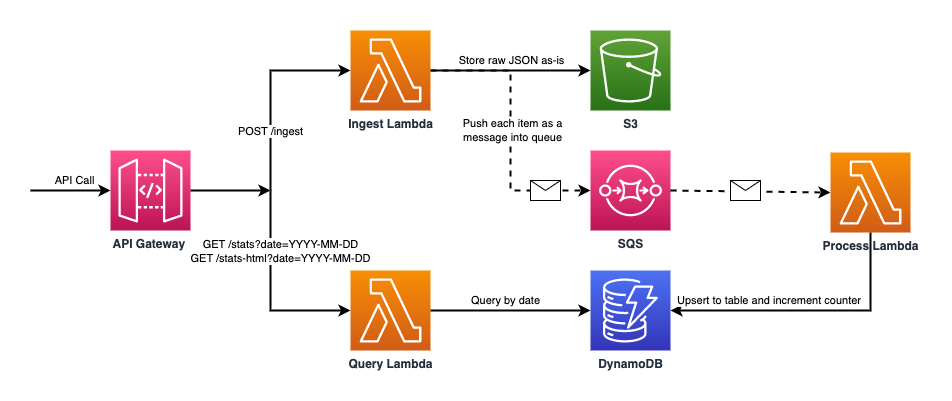

# Device Pipeline 

## Table of Contents

- [Description](#description)
- [Architecture and Flow](#architecture-and-flow)
  - [Example Payload](#example-payload)
  - [Data Model for Aggregates](#data-model-for-aggregates) 
- [Deployment](#deployment)
  - [Prerequisites](#prerequisites)
  - [Setup](#setup)
- [Testing](#testing)
  - [Manual Testing](#manual-testing)

## Description

This project implements a **scalable backend solution for data ingestion and processing**, designed as a technical assignment.
* **Infrastructure**: AWS CDK (TypeScript) provisions the stack
* **Business logic**: AWS Lambda functions written in Python
* **Storage**: 
  * Raw ingestion data persisted in **S3** (low-cost storage)
  * Aggregated results stored in **DynamoDB** (quick access)
* **Asynchronous pipeline**: Ingestion -> SQS -> Processing Lambda -> DynamoDB
* **Synchronous API**: API Gateway exposes endpoints for ingesting and querying data
* **Visualization**: Aggregated counts by date, type, and state can be retrieved in JSON or HTML table format
* **Extra utility**: A Python script generates random device events and feeds them to the API

## Architecture and Flow

1. Client `POST /ingest` -> **Ingest Lambda**
   * Validates payload and stores entire request body *as-is* in S3
   * Fans out each item as a message into SQS queue (+ DLQ for failing messages)
2. SQS event source -> **Process Lambda** 
   * Consumes SQS messages
   * Updates per-day aggregate counters in DynamoDB
3. Client `GET /stats?date=YYYY-MM-DD` or `GET /stats-html?date=YYYY-MM-DD` -> **Query Lambda**
   * Queries the `date` partition in DynamoDB and returns aggregates in JSON (`/stats`) or HTML table format (`/stats-html`)



### Example Payload

This is an example of payload ingested and stored in S3

```json lines
{
  "processed_devices": [
    { 
      "type": "laptop", 
      "state": "erased", 
      "timestamp": "2023-06-16T13:00:00Z"
    },
    { 
      "type": "server", 
      "state": "erased", 
      "timestamp": "2023-06-16T12:00:00Z"
    },
    { 
      "type": "phone", 
      "state": "erased", 
      "timestamp": "2023-06-16T11:00:00Z"
    },
    { 
      "type": "phone", 
      "state": "erasure failed", 
      "timestamp": "2023-06-16T10:00:00Z"
    },
    { 
      "type": "laptop", 
      "state": "erased", 
      "timestamp": "2023-06-15T10:00:00Z"
    }
  ]
}
```

### Data Model for Aggregates

Counts are grouped by `date`, `type` and `state` in DynamoDB table where each item represents one triple
* Partition key (PK): `date` (string, date part taken from `timestamp`, e.g. `2023-06-16`)
* Sort key (SK): `type_state` (string, concatenated `type` and `state`, e.g. `laptop#erased`)
* Attributes: `type`, `state`, `count` (number)

The processor lambda will atomically add `count :1` for each incoming device entry

> Although each item contains `timestamp`, only the date part is used since the aggregation is defined *per date*. This  
> prevents every event from creating a separate counter defeating the purpose of aggregation (millis will effectively 
> make every record unique). Nevertheless, the raw data with exact timestamps is always available in S3

## Deployment

### Prerequisites

* AWS account with credentials configured (`aws configure`)
* Node.js + npm
* AWS CDK v2 (`npm install -g aws-cdk`)
* Python 3.12 and virtualenv

### Setup

From the project root run the following commands: 

```bash
npm install 
python3 -m venv venv
source venv/bin/activate
pip install -r requirements-dev.txt
```

(First time) CDK Bootstrap
    
```bash
npx cdk bootstrap
```

Build and deploy 

```bash
npm run build
npx cdk deploy
```

The deployment will emit CloudFormation outputs:  
* `ApiUrl` (API Gateway base URL)
* `BucketName` (S3)
* `QueueUrl` (SQS)
* `TableName` (DynamoDB)

## Testing

Run all tests

```bash
npm test
```

* **Python tests** use `pytest` with [moto](https://github.com/getmoto/moto) to mock AWS (S3, SQS, DDB). `tests_py/` covers
all three Lambdas and helpers
* **CDK tests** (Jest) assert that all three Lambda functions exist and are Python runtimes

### Manual Testing

* Send the sample payload 

```bash
curl -X POST $API/ingest \
 -H "Content-Type: application/json" \
 -d @docs/sample.json
```

* Generate and ingest random data with `scripts/feed_generator.py`. The script runs from the command line and takes API URL as an argument

```bash
python3 scripts/feed_generator.py $API
```

Example response 

```bash
200 {"status": "accepted", "raw_key": "raw/<date-uuid>.json", "enqueued": <number_of_items>}
```

* Fetch data with the following command

```bash
API=$(npx cdk output ApiUrl)
curl -sS "$API/stats?date=2025-09-30" | jq
```

Successful response will contain data aggregates if any

```json lines
[
  {
    "date": "2025-09-30",
    "type": "laptop",
    "state": "erased",
    "count": 1
  },
  {
    "date": "2025-09-30",
    "type": "laptop",
    "state": "erasure failed",
    "count": 1
  }
]
```

For HTML table view example run

```bash
open "$API/stats-html?date=2025-09-30"
```

